# Project Alpha

**한국 주식시장을 위한 퀀트 리서치·포트폴리오 설계 플랫폼입니다.**
팩터 스크리닝과 백테스트, 거시 국면 판단, 포트폴리오 최적화, 모의 집행까지 하나의 흐름으로 잇고, 모든 수치에 출처와 측정 범위(무엇을 쟀고 무엇을 재지 않았는지)를 함께 표기합니다.

이태호 · 개인 프로젝트 · [taeho2267@gmail.com](mailto:taeho2267@gmail.com)

[](https://github.com/head1320-cell/Project-Alpha/actions/workflows/ci.yml)

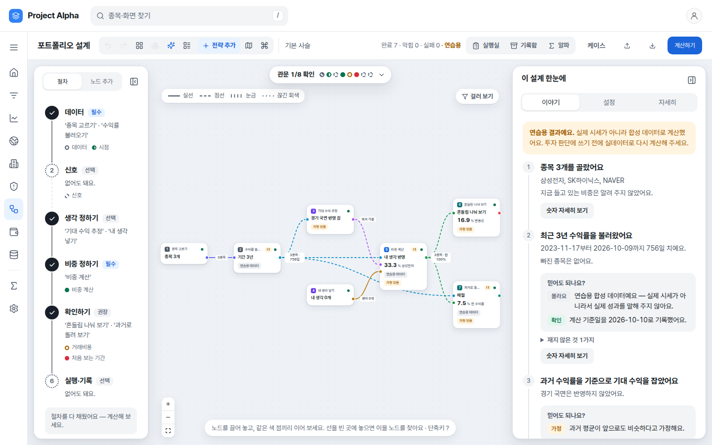

<sub>이 문서의 모든 화면은 API 키 없이 구동되는 연습용(합성) 데이터로 촬영했습니다. 실제 시세나 실제 계좌가 아닙니다.</sub>

---

## 설계 목적

- **리서치에서 집행까지 하나의 파이프라인.** 종목 선별, 백테스트, 국면 판단, 비중 산출, 주문이 서로 다른 도구에 흩어져 있으면 의사결정의 근거가 끊깁니다. 이 플랫폼은 각 단계의 산출물을 다음 단계의 입력으로 그대로 넘깁니다.
- **결론보다 증거가 먼저.** 수치마다 관측값인지, 가정인지, 합성 데이터인지, 측정하지 못한 값인지를 구분해 표시합니다. 알 수 없는 값을 0으로 채우지 않으며, 합성 데이터로 얻은 Sharpe를 실제 초과성과의 근거로 제시하지 않습니다.
- **실자금 이전에 충분한 검증.** 주문의 기본 실행 모드는 기록만 하는 SHADOW입니다. 모의 체결(PAPER)로 집행 경로를 점검한 뒤에도, 실계좌(LIVE)는 운영자가 근거와 허용 사용자를 선언해 관문을 열어야만 사용할 수 있습니다.

## 리서치 워크플로우

실제 사용 순서는 다음과 같습니다.

1. **종목 찾기**: 유동성 게이트와 팩터 조건으로 유니버스를 좁힙니다.
2. **백테스트**: 선별 규칙의 과거 성과를 거래비용과 함께 재현합니다.
3. **매크로 분석**: 성장과 물가 두 축으로 현재 국면을 확인합니다.
4. **포트폴리오 설계**: 종목, 기대수익, 국면 시각을 캔버스에 조립하고 비중을 산출합니다.
5. **증거 관문 점검**: 시점 정합, 거래비용, 표본외 검증 등 어떤 확인을 거쳤는지 점검합니다.
6. **내 계좌**: 모의 체결로 주문을 내고, 주문이 집행 경로의 어느 단계까지 진행됐는지 확인합니다.

각 화면에는 다음 단계로 결과를 넘기는 동선이 있습니다. 종목 찾기의 "설계에 넣기", 매크로 분석의 "포트폴리오 설계에 넣기"가 그 예입니다.

---

## 핵심 기능: 포트폴리오 설계 캔버스

포트폴리오 구성 과정을 **노드와 링크**로 조립하는 작업 공간입니다. 노드는 하나의 계산 단위(종목 선택, 수익률 적재, 기대수익 추정, 비중 최적화, 리스크 분해, 백테스트 등)이고, 링크는 노드 사이에 어떤 데이터(수익률 행렬, 기대수익 시각, 비중 벡터 등)가 흐르는지를 나타냅니다. 설계 전체를 한 번에 계산하며, 각 단계의 결과와 그 근거가 카드와 해설로 남습니다.

**활용 장면**
- 소수 종목의 편입 비중을 근거와 함께 결정할 때
- 동일한 유니버스에서 최적화 방법만 바꿔 결과를 나란히 비교할 때
- 어떤 검증을 거쳤고 어떤 검증이 남았는지 한눈에 파악할 때

**지원하는 비중 산출 방법**
평균-분산(MVO), Black-Litterman, 엔트로피 풀링, 리스크 패리티, HRP(계층적 위험 균형), 최소분산, 최대분산, Min-CVaR, 강건 최적화, 위험 성향 기반 효용 최적화를 노드 설정에서 선택합니다. 사용자의 시각(view)은 별도 노드로 입력해 Black-Litterman과 엔트로피 풀링에 반영합니다.

**사용 방법**
1. **설계 시작.** 툴바의 "목표로 시작"에서 목적을 고르거나 템플릿을 불러옵니다. 빈 캔버스에서 노드를 하나씩 배치해도 됩니다.
2. **연결.** 같은 색의 포트끼리 링크로 연결합니다. 타입이 맞지 않는 연결은 사유와 함께 거부됩니다.
3. **계산.** "계산하기"를 실행하면 노드별 결과가 카드에 표시됩니다. 설정을 바꾸면 영향을 받는 하류 노드만 "예전 결과"로 표시되어 부분 재계산이 가능합니다.
4. **절차 확인.** 왼쪽 "절차" 탭은 데이터 → 신호 → 시각 설정 → 비중 산출 → 검증 → 집행·기록 단계별 충족 여부를 보여 주고, 하단 안내 줄이 다음에 연결할 노드를 제안합니다.
5. **증거 관문.** 상단 관문 표시는 데이터 무결성, 시점 정합(PIT), 신호 타당성, 거래비용, 표본외 강건성 등 각 관문의 판정을 보여 줍니다. 판정을 누르면 그 판정을 만든 노드로 이동합니다. 건너뛴 관문은 통과한 관문으로 간주하지 않습니다.
6. **비교와 보존.** 노드에서 "갈래 만들기"를 실행하면 설정만 바꾼 복제본이 생성되어 원본과 나란히 비교할 수 있고, 갈래 간 비교에는 다중 검정을 반영한 Deflated Sharpe가 함께 표시됩니다. 설계는 파일로 내보내고 다시 불러올 수 있습니다.

| 링크 살펴보기 | 간단히 보기 |
|---|---|
| 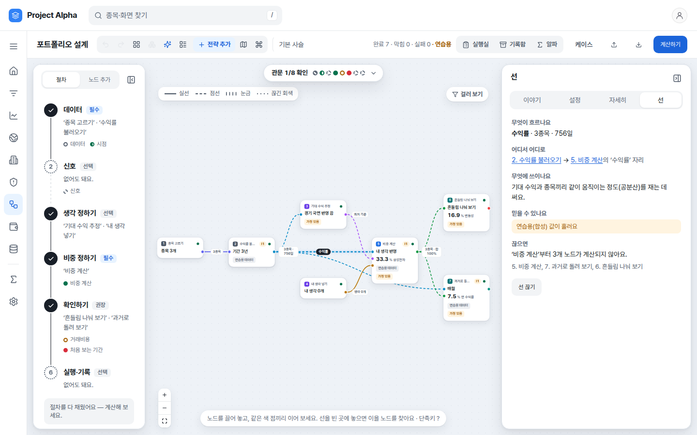 | 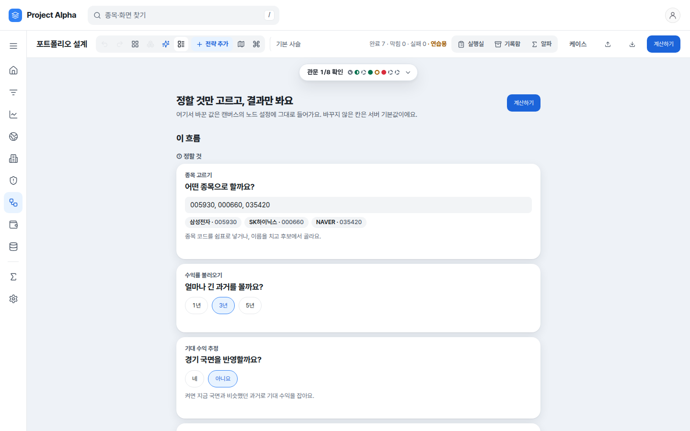 |
| 링크를 선택하면 전달되는 데이터의 형태와 규모, 받는 노드가 그 데이터를 어디에 쓰는지, 데이터의 출처 등급, 연결을 끊을 때 계산이 멈추는 하류 노드를 보여 줍니다. | 노드 구성이 익숙하지 않다면 "간단히 보기"로 전환합니다. 결정할 항목만 질문 형식으로 묻고 결과는 문장으로 요약하며, 여기서 바꾼 값은 캔버스 설정에 그대로 반영됩니다. |

오른쪽 "이야기" 탭은 계산 결과를 단계별 문장으로 해설하고, 단계마다 **이 결과를 신뢰할 수 있는가** 항목을 붙여 합성 데이터 여부, 가정, 측정하지 않은 항목을 모아 보여 줍니다.

---

## 주요 도구

### 홈
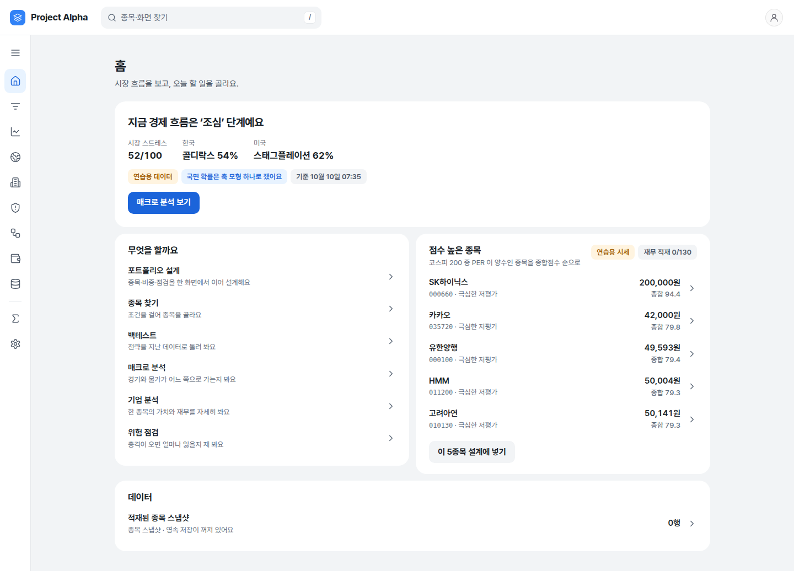

- **기능** 현재 거시 환경을 한 문장으로 요약하고(시장 스트레스, 한국·미국 국면 확률, 권장 단계), 작업 목록과 종합점수 상위 종목을 보여 줍니다.
- **활용** 하루의 리서치를 시작할 때 시장 분위기와 우선 작업을 정합니다.
- **사용법** "이 5종목 설계에 넣기"를 누르면 해당 종목으로 포트폴리오 설계 캔버스가 열립니다.

### 종목 찾기
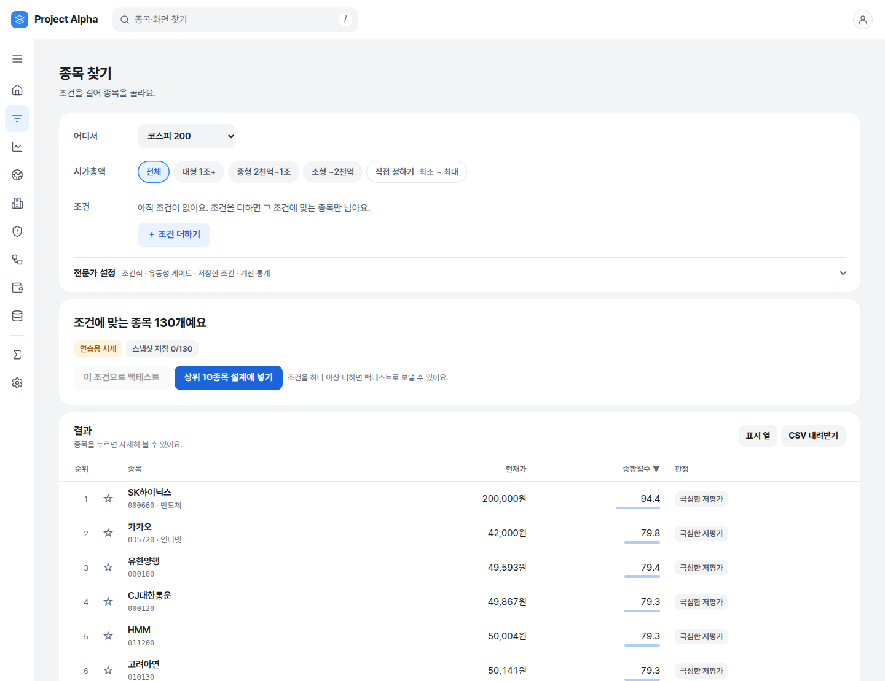

- **기능** 코스피 200 등의 유니버스에 재무, 밸류에이션, 가격, 기술적 팩터 조건을 적용해 종목을 선별합니다. 유동성 게이트 → 팩터 필터 → 후처리 분석의 3단 구조로 동작합니다.
- **활용** 투자 아이디어를 검증 가능한 종목 목록으로 바꿀 때 사용합니다.
- **사용법** "조건 더하기"로 팩터와 임계값을 지정합니다. 조건식 결합, 유동성 게이트, 저장한 조건은 "전문가 설정"에 있습니다. 결과 행을 선택하면 우측 시트에서 요약을 확인하고 기업 분석이나 캔버스로 넘길 수 있으며, 결과는 CSV로 내려받을 수 있습니다.

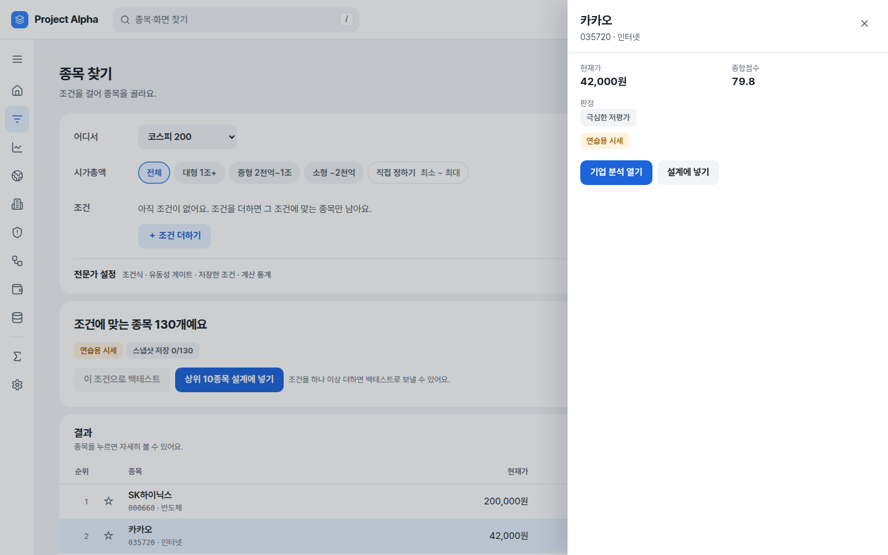

### 백테스트
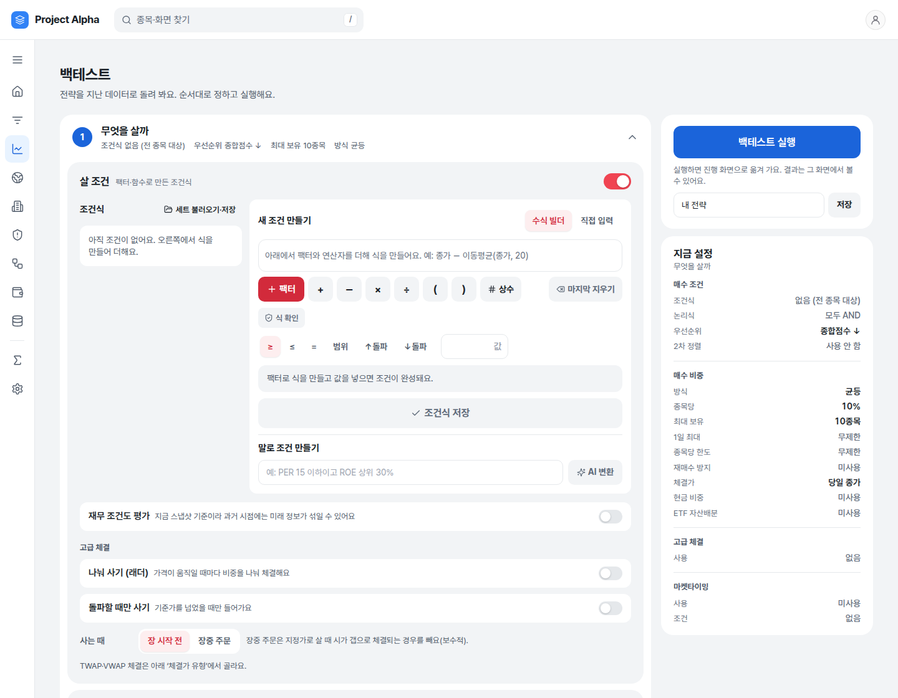

- **기능** 매수·매도 규칙을 과거 데이터에 적용해 누적 수익률, CAGR, 최대 낙폭(MDD), 변동성, Sharpe, 벤치마크 대비 초과수익과 베타·알파를 산출합니다. 수수료, 슬리피지, 세금, 생존편향, 시점 정합 여부를 함께 다룹니다.
- **활용** 스크리닝 조건이나 매매 규칙이 과거 국면에서 어떻게 작동했는지 확인할 때 사용합니다.
- **사용법** ① 매수 규칙 ② 매도 규칙 ③ 매매 대상 ④ 자금·기간·비용 순으로 설정합니다. 조건은 팩터와 연산자를 조합한 식으로 만들거나 "말로 조건 만들기"에 자연어로 입력합니다. 우측 "지금 설정"이 현재 설정을 요약하며, "백테스트 실행" 후 진행 화면을 거쳐 결과 화면으로 이동합니다.

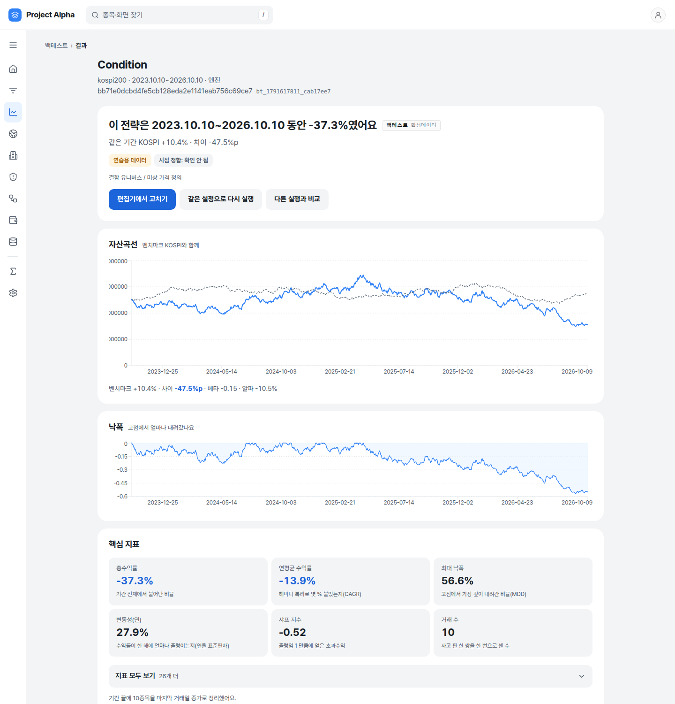

결과 화면은 "해당 기간 동안 총수익률"과 벤치마크 대비 차이를 먼저 제시하고, 데이터 종류(합성 여부)와 시점 정합 판정을 함께 표시합니다. 다른 실행과의 비교, 동일 설정 재실행을 지원합니다. 위 화면은 연습용 데이터로 실제 실행한 결과입니다.

### 매크로 분석
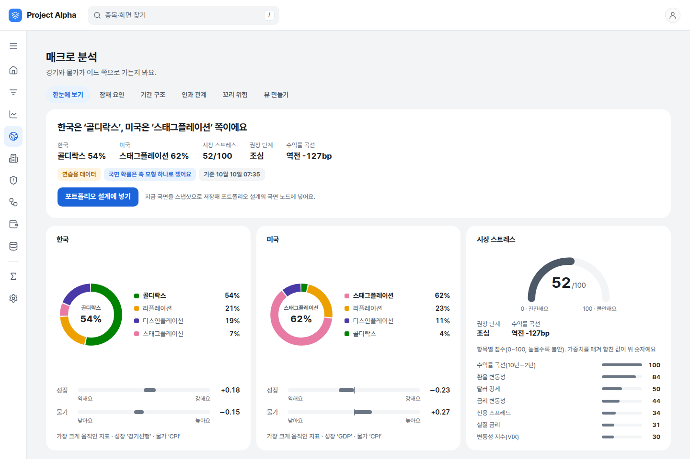

- **기능** 성장과 물가의 두 축으로 한국과 미국의 거시 국면(골디락스, 리플레이션, 스태그플레이션, 디스인플레이션)을 확률로 판정하고, 시장 스트레스 지수와 수익률 곡선 역전 여부를 제시합니다. 잠재 요인, 기간 구조, 인과 관계, 꼬리 위험 분석과 사용자 시각 구성 도구도 포함합니다.
- **활용** 자산 배분의 방향과 위험 노출 수준을 정할 때 사용합니다.
- **사용법** 탭에서 지표, 국면, 전략, 상관, 타이밍을 차례로 검토합니다. "포트폴리오 설계에 넣기"를 누르면 현재 국면이 스냅샷으로 저장되어 캔버스의 국면 노드에 입력됩니다.

### 기업 분석
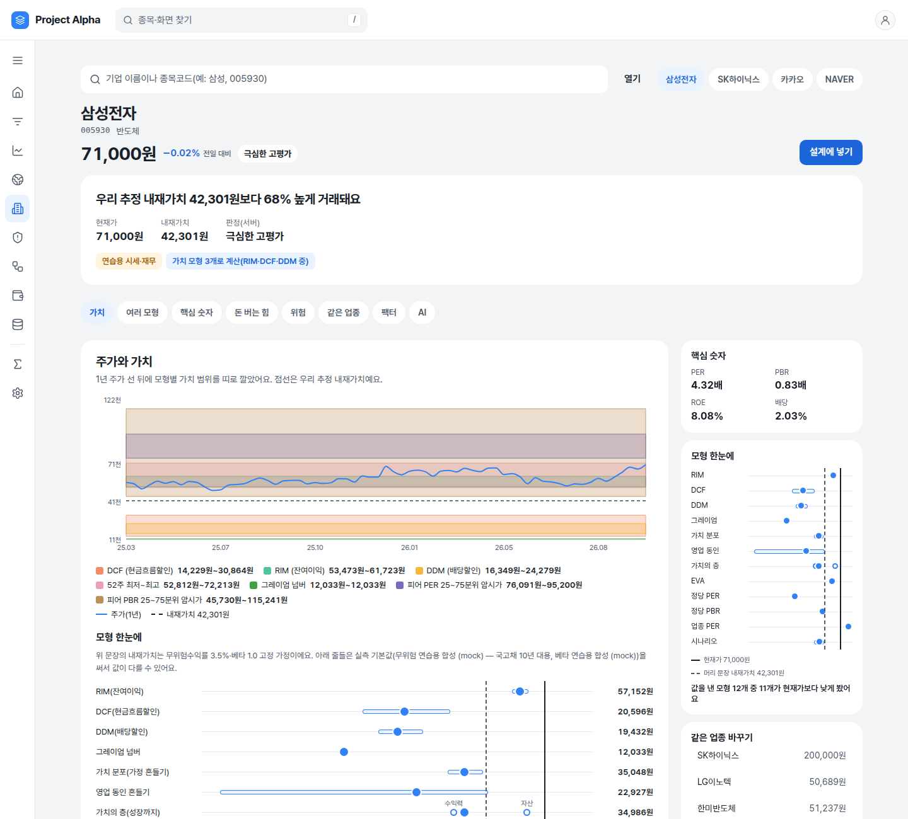

- **기능** 개별 종목의 내재가치를 잔여이익모형(RIM), 현금흐름할인(DCF), 배당할인(DDM) 등 복수의 모형으로 산출하고, 1년 주가 위에 모형별 가치 범위를 겹쳐 보여 줍니다. 역DCF(내재 성장률), 몬테카를로 가치 분포, EVA, 배수 비교, 재무 품질, 부도·이익조작 위험 지표, 동종업계 비교, 팩터 백분위를 한 페이지에서 다룹니다.
- **활용** 현재 가격이 어떤 성장 가정을 내포하는지, 모형 간 추정이 얼마나 갈리는지 확인할 때 사용합니다.
- **사용법** 상단 검색 칸에 종목명이나 종목코드를 입력합니다. 목차에서 원하는 절로 이동하며, "설계에 넣기"로 해당 종목을 캔버스에 넘길 수 있습니다.

### 위험 점검
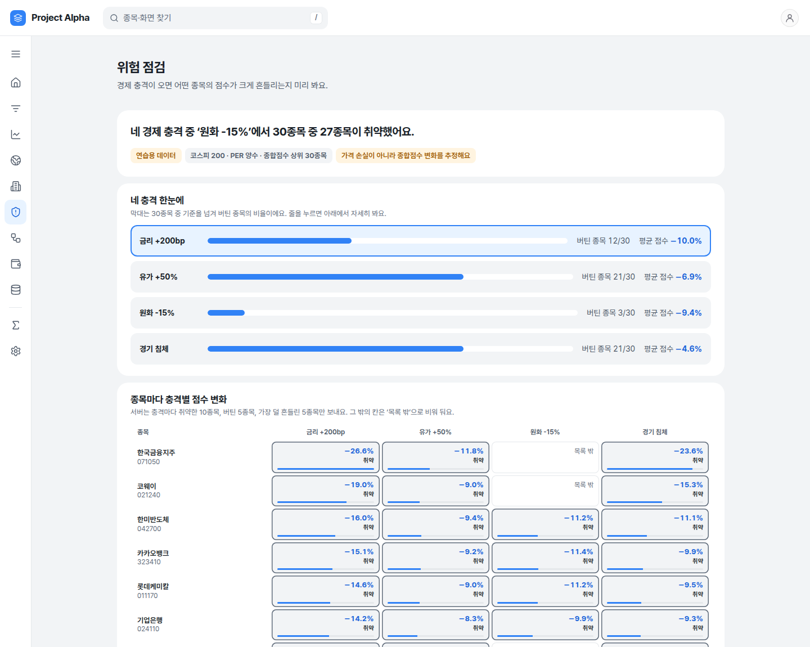

- **기능** 금리, 유가, 환율, 경기 침체 등의 충격 시나리오를 적용해 종목별 종합점수 변화와 취약 종목을 산출합니다.
- **활용** 편입 후보가 어떤 거시 충격에 취약한지 사전에 파악할 때 사용합니다.
- **사용법** 상단 시나리오를 선택하면 하단 상세가 해당 시나리오로 전환되고, 종목×시나리오 칸에 초점을 두면 그 종목의 점수 변화를 읽어 줍니다.

### 내 계좌
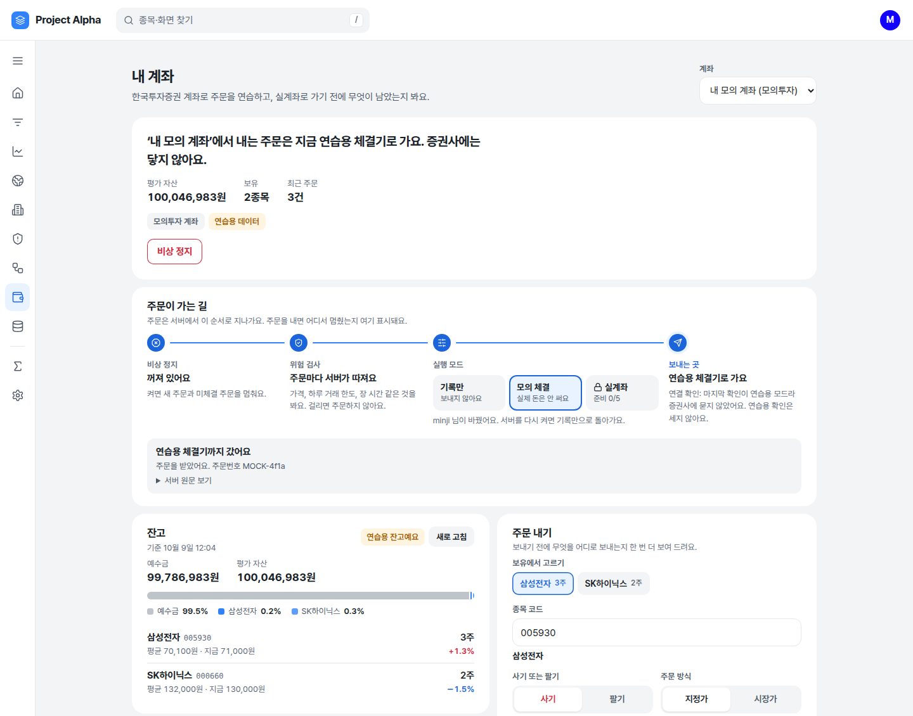

- **기능** 본인의 한국투자증권 계좌로 주문을 연습합니다. 서버가 주문을 처리하는 순서(킬 스위치 → 위험 검사 → 실행 모드 → 전송처)를 그대로 시각화해, 주문이 어느 단계에서 멈췄는지 표시합니다.
- **활용** 설계한 포트폴리오를 실자금 없이 집행 단계까지 점검할 때 사용합니다.
- **사용법** 먼저 **설정 → 내 증권 계좌**에서 계좌를 연결합니다(자격 증명은 서버에 암호화해 저장하며 화면에는 끝 네 자리만 표시합니다). 실행 모드는 SHADOW(기록만)가 기본이며 PAPER(모의 체결) 전환에는 확인 단계를 거칩니다. LIVE는 잠겨 있고 남은 준비 항목을 목록으로 보여 줍니다. 필요 시 "비상 정지"로 신규 주문과 미체결 주문을 즉시 중단합니다.

### 기타
- **데이터 상태** 데이터 원천별 연결 여부, 연구 활용 등급, 적재 현황을 보여 줍니다.
- **파생상품 계산기** 옵션 가격과 그릭스, 채권 듀레이션과 볼록성, 선물 헤지 계약 수, 신용가치조정(CVA)을 계산합니다.
- **관리 화면(관리자 전용)** 운영 계좌의 실행 모드와 킬 스위치, 실계좌 관문, 멀티 전략 백테스트, 현실성 점검(시장 충격·현금 이자 반영)을 제공합니다.

---

## 설명가능성: 수치의 신뢰 범위를 함께 보여 주는 방식

이 플랫폼이 가장 중요하게 다루는 원칙입니다.

- **데이터 출처 표기.** 합성 데이터로 계산된 화면에는 "연습용 데이터" 표시가 항상 붙습니다. 합성 결과를 실데이터 결과처럼 제시하지 않습니다.
- **미상은 0이 아닙니다.** 산출하지 못한 값은 "몰라요"와 그 사유로 표시하며 0%나 빈칸으로 대체하지 않습니다.
- **실패의 명시.** 서버 거절이나 연결 실패는 원인과 재시도 동선을 함께 보여 줍니다. 조용한 대체값을 쓰지 않습니다.
- **성과 라벨.** 백테스트와 시뮬레이션 수치 옆에는 그 수치의 종류(백테스트, 합성 데이터 등)를 밝힙니다. 백테스트 성과는 예측력의 증거가 아니며, 회전율 감소는 예측력과 다르고, 통계적 유의성은 집행 가능성과 다릅니다.
- **증거 관문.** 데이터 무결성 → 시점 정합 → 신호 타당성 → 포트폴리오 전달 → 거래비용 → 표본외 강건성 → 경제적 가치 → 모의/실계좌 순으로 어떤 관문을 거쳤는지 표시합니다. 건너뛴 관문은 통과한 관문이 아닙니다.
- **실계좌와 유통의 차단.** 실계좌 주문은 운영자의 근거 선언 없이는 열리지 않으며, 전략을 제3자에게 유통하는 기능은 인가 확인 전까지 만들지 않습니다.

---

## 실행 방법

API 키 없이도 연습용 데이터로 전 화면이 동작합니다.

```bash
git clone https://github.com/head1320-cell/Project-Alpha.git
cd Project-Alpha
cp .env.example .env          # 기본값 KIS_USE_MOCK=1, 외부 호출 없이 연습용 데이터로 동작
docker compose up --build -d
```

- 웹 화면 <http://localhost:3000>
- API 문서 <http://localhost:8000/docs>

Docker 없이 실행하려면 다음과 같이 합니다.

```bash
python -m venv venv && source venv/bin/activate
pip install -r requirements.txt
uvicorn main_api:app --reload --port 8000

cd frontend && npm install && npm run dev          # 별도 터미널
```

실데이터를 사용하려면 `.env`에 키를 입력하고 `KIS_USE_MOCK=0`으로 바꿉니다. 주요 키는 한국투자증권(`KIS_APP_KEY`·`KIS_APP_SECRET`), 전자공시(`DART_API_KEY`), 한국거래소(`KRX_API_KEY`), 한국은행·미국 연준 경제자료(`BOK_API_KEY`·`FRED_API_KEY`)입니다. 전체 목록과 설명은 [`.env.example`](./.env.example)에 있습니다. `KIS_IS_PAPER=0`은 실계좌이므로 실제 자금이 거래됩니다.

검증은 `make all`(린트, 테스트, 타입 검사, 빌드. CI와 동일)로 수행하며, 화면 테스트는 `cd frontend && npx playwright test`로 실행합니다.

## 기술 스택

- **프론트엔드** Next.js 14 · React · TypeScript · React Flow(캔버스) · Recharts · TanStack Query · Pretendard
- **백엔드** Python 3.11 · FastAPI · SQLAlchemy · PostgreSQL(미설정 시 SQLite) · NumPy · pandas · SciPy
- **데이터** 한국투자증권 Open API · OpenDART · 한국거래소 · 한국은행 ECOS · FRED
- **검증** pytest · Playwright · GitHub Actions · Docker Compose

## 문서

| 문서 | 내용 |
|---|---|
| [제품 로드맵](./docs/plans/2026-09-12-ra-product-roadmap.md) | 리서치, 포트폴리오 운용, 설명가능성, 전략 평가의 단계와 순서 |
| [개발 이력](./docs/HISTORY.md) | 무엇을, 왜 했으며, 무엇을 하지 않았는지에 대한 기록 |
| [채점표](./docs/specs/2026-09-12-addendum-scorecard.md) | 합격 기준별 판정과 근거 |
| [제품 규칙](./docs/specs/2026-09-12-ra-product-rules.md) | 주장의 범위와 표현 규칙 |
| [`CLAUDE.md`](./CLAUDE.md) | 개발을 보조하는 AI 에이전트용 작업 규칙(제품 소개 문서가 아님) |

## 책임 한계

본 프로젝트는 연구와 개인 학습을 목적으로 합니다. **투자 자문이 아니며**, 백테스트 결과는 미래 수익을 보장하지 않습니다. 실계좌로 전환하면 실제 자금이 거래되므로 충분히 검증한 뒤 본인 책임 아래 사용하시기 바랍니다. API 키는 커밋하지 마십시오(`.env`는 `.gitignore`에 포함되어 있습니다). 투자자문업과 투자일임업은 인가 사항이므로, 인가 확인 전에는 전략을 제3자에게 유통하는 기능을 활성화하지 않습니다.

## 만든 사람

**이태호** · 개인 프로젝트 · [taeho2267@gmail.com](mailto:taeho2267@gmail.com)
